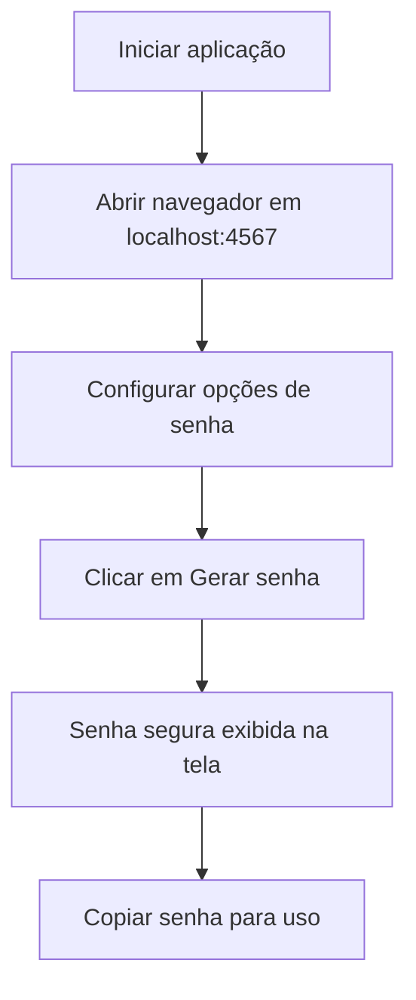

# Documentação de Usuário

Este documento apresenta um resumo do projeto e um fluxograma de uso para o usuário final.

## Resumo do projeto

O ProjetoAKCIT é uma aplicação Java que gera senhas seguras a partir de uma interface web leve. O usuário pode configurar:

- Comprimento da senha
- Inclusão de letras maiúsculas
- Inclusão de letras minúsculas
- Inclusão de dígitos
- Inclusão de símbolos

A aplicação executa um servidor HTTP local e disponibiliza a interface em:

```text
http://localhost
```

## Como usar

1. Inicie a aplicação usando Maven ou o `Makefile`.
2. Abra o navegador em `http://localhost`.
3. Ajuste as opções de senha conforme desejado.
4. Clique em **Gerar senha**.
5. Copie a senha gerada e use onde precisar.

## Fluxo de uso



## Observações importantes

- A senha é gerada localmente no navegador HTTP do próprio computador.
- Não há armazenamento de senhas no servidor.
- Se quiser, use uma senha diferente a cada nova geração.

## Contato

Se precisar de ajuda ou quiser dar sugestões, abra uma issue no repositório GitHub do projeto.
